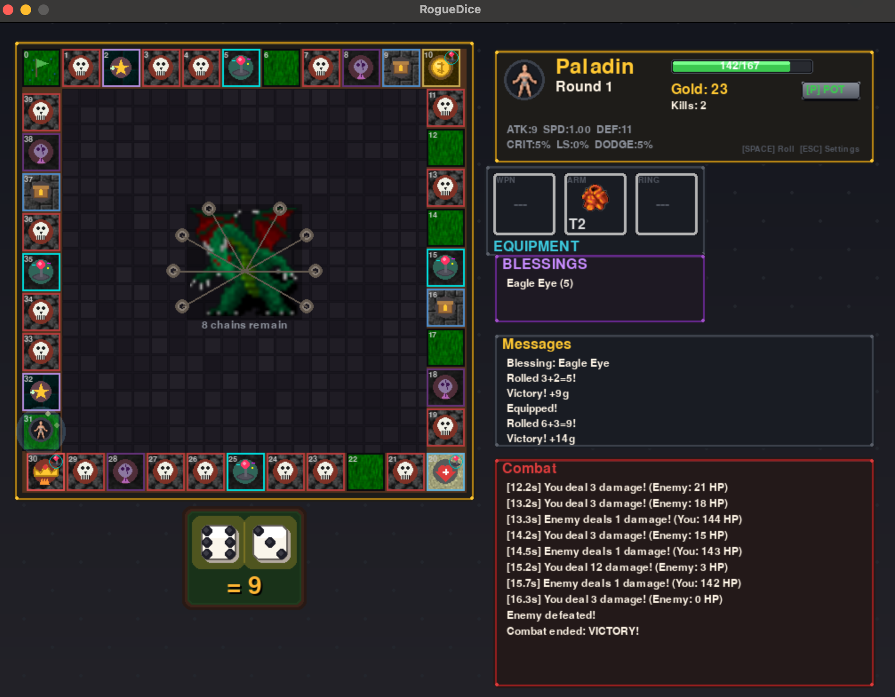
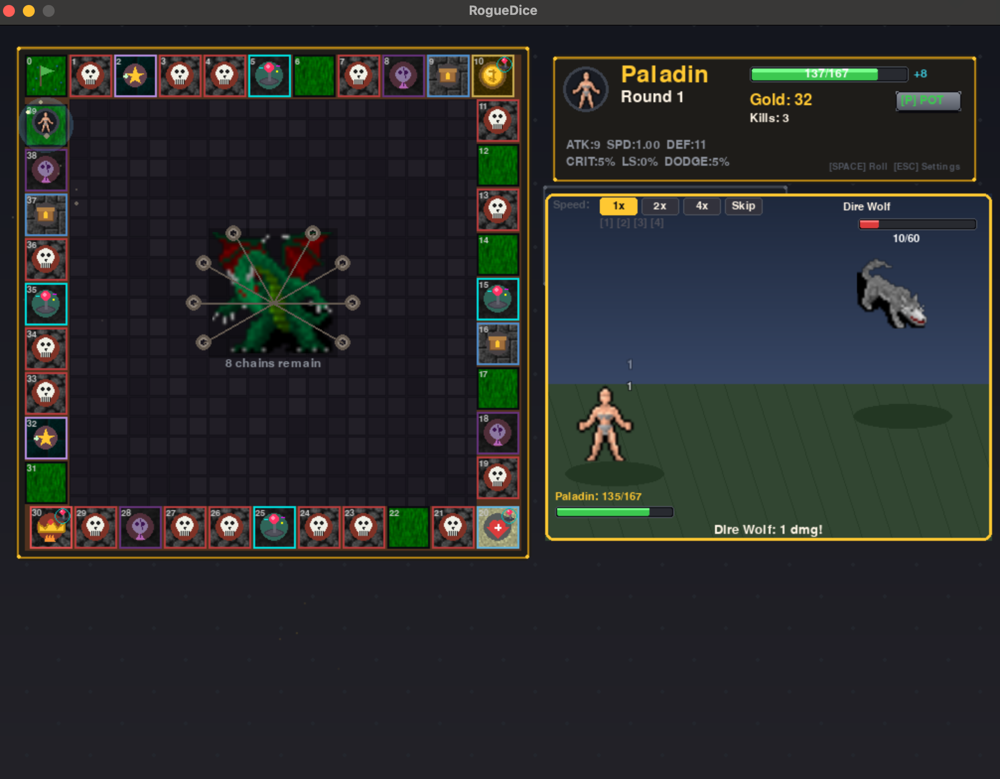

# RogueDice

A roguelike board game where you roll dice, fight monsters, collect loot, and unlock permanent upgrades. Built with Python and Pygame.

## Screenshots

| Main Game | Battle Scene |
|-----------|--------------|
|  |  |

## Features

- **6 Unique Characters** - Each with different dice mechanics and playstyles
- **Monopoly-style Board** - 40 squares with monsters, items, blessings, and shops
- **Automatic Combat** - Tick-based auto-battler with crits, life steal, and more
- **Item Rarities** - Common to Mythical with scaling stats
- **Permanent Progression** - Gold persists after death for upgrades and character unlocks
- **Boss Encounters** - Defeat the boss after round 20 to win and unlock new features

## Characters

| Character | Dice | Style |
|-----------|------|-------|
| Warrior | 2d6 | Balanced, +10% HP |
| Rogue | 3d4 | Consistent movement, +crit, +speed |
| Berserker | 1d12 | High variance, +damage, life steal |
| Paladin | 2d6 (reroll 1s) | Reliable, +defense, bonus healing |
| Gambler | 1d6+1d8 | Extended range, +gold find |
| Mage | 2d4+2 | Very consistent, spells ignore defense |

## Installation

```bash
# Clone the repository
git clone https://github.com/yourusername/RogueDice.git
cd RogueDice

# Install dependencies
pip install -r requirements.txt

# Run the game
python -m roguedice.main
```

## Controls

| Key | Action |
|-----|--------|
| SPACE | Roll dice / Take turn |
| P | Use potion (full heal) |
| E | Equip item |
| S | Sell item |
| 1-3 | Select jewelry slot |
| R | Restart (after game over) |
| ESC | Back / Close menu |

## How to Play

1. **Roll dice** to move around the board
2. **Fight monsters** on red squares (automatic combat)
3. **Collect items** on blue squares - equip or sell for gold
4. **Visit shrines** for temporary or permanent blessings
5. **Rest at the inn** to fully heal
6. **Shop at the merchant** for items, blessings, and potions
7. **Defeat the boss** after round 20 to win!

## Progression

- Gold earned during runs persists after death
- Spend gold on permanent stat upgrades (HP, damage, crit, etc.)
- Unlock new characters with unique dice mechanics
- Boss victories unlock special features and free characters

## Architecture

Built with an Entity Component System (ECS):

```
roguedice/
├── core/           # ECS framework
├── components/     # Data (Stats, Position, Item, etc.)
├── systems/        # Logic (Combat, Movement, Loot)
├── factories/      # Entity creation
├── services/       # Game orchestration
├── models/         # Enums, Characters, Blessings
├── ui/             # Pygame rendering
└── data/           # JSON templates
```

## Requirements

- Python 3.8+
- Pygame 2.5+

## License

MIT License
